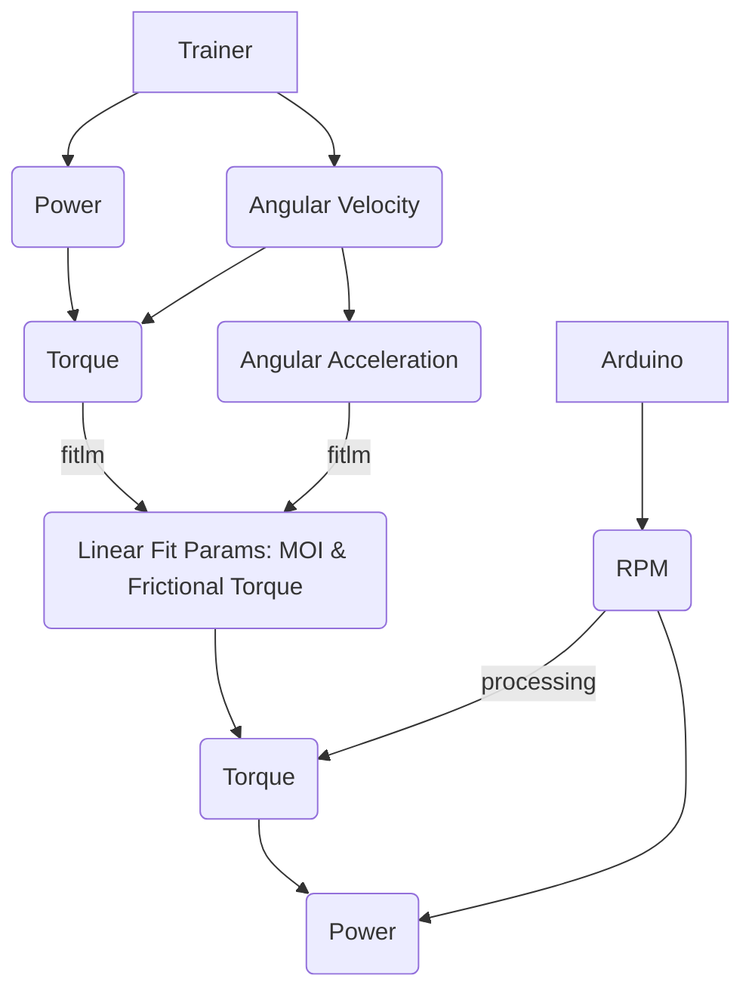

```mermaid
flowchart TD
    A[Trainer] --> B(Power)
    A--> C(Angular Velocity)
    C --> D(Torque)
    B --> D
    C --> E(Angular Acceleration)
    D --> |fitlm| F(Linear Fit Params: MOI & Frictional Torque)
    E --> |fitlm| F

    G[Arduino] --> H(RPM)
    H --> |processing| I(Torque)
    F --> I
    I --> J(Power)
    H --> J
```