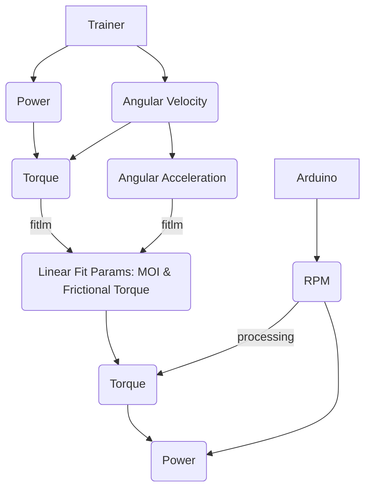

# Power-Output-Testing

Code repository for pilot power output testing and thrust determination.

## Serial Port Setup

Follow these steps to set up the system using the serial port:

1. Clone the repository.
2. Open MATLAB and Arduino IDE.
3. Plug in the Arduino into your machine.
4. Connect the Arduino to COM3 (or another port, adjusting the code accordingly).
5. Open `Arduino_Power_Code.ino` in the Arduino IDE.
6. Under `Tools`, ensure that `Board` is set to `Arduino Uno`, and under `Port`, make sure it is set to `COM3`.
7. Upload `Arduino_Power_Code.ino` to the Arduino.
8. Open `SerialPortCode.m` in MATLAB.
9. Configure the `duration` in `SerialPortCode.m` to be approximately 2 minutes, depending on the test (add 5 seconds for safety).
10. Once `SerialPortCode.m` is started, enter the data file name (format: initials\_#.txt), and when ready, press the space bar to start recording data.

Run the test by starting the code _before_ starting to pedal.

## Moment of Inertia Calculation

To find the moment of inertia (MOI) of the test rig:

1. Set up using the serial port as described above.
2. Monitor the live plot for any erroneous indications.
3. Plug data from the trainer ('Record' field) .csv into `modelTrainerData.m` to get MOI and torqueFriction (table input also supported).

## Data Structures

Data from Onland Testing is available in `OnlandTesting` in `OnlandTestingData.mat`

```matlab
OnlandTesting = 

  struct with fields:

    CG: [1×3 struct]
    CJ: [1×2 struct]
    KB: [1×3 struct]
    MC: [1×3 struct]
    MD: [1×3 struct]
    NQ: [1×3 struct]

OnlandTesting.CG(1) =

  struct with fields:

       trainerData: [122×5 table]
       arduinoData: [406×1 double]
    trainerResults: [122×4 table]
    arduinoResults: [406×4 table]
               MOI: 4.0138
         TORQFRICT: 7.0816

OnlandTesting.CG(1).arduinoResults =

  406×4 table

     times      rpm      torque    power 
    _______    ______    ______    ______

          0         0    19.916    41.983
    0.65446    91.678    19.619    110.09

       :         :         :         :   

     119.81    229.24    4.9603    119.82

OnlandTesting.CG(1).trainerResults =

  122×4 table

    times     rpm      torque    power
    _____    ______    ______    _____

       0          0         0       0 
       1     12.241    5.4607       7 

      :        :         :         :  

     121     316.16    7.0374     233 

```

- `trainerData` and `arduinoData` contain data directly from their respective data sources.
- `trainerResults` and `arduinoResults` contain processed data in table format, including times, rpm, torque, and power, according to `modelTrainerData` and `deriveValues`, respectively.

_A binary for water testing will be added once complete_

## Scripts and Functions

- `Arduino_Power_Code.ino`
  Arduino code to read button presses and send activation states to MATLAB through serial communication.

- `SerialPortCode.m`
  MATLAB code to read serial data from Arduino using the `serialport` object, collect and visualize data, and save it to a file.

- `derivative.m`
  MATLAB function to compute the derivative of discrete x and y data using various methods.

- `deriveValues.m`
  MATLAB function to calculate derived parameters (rpm, torque, power) from revolution times data.

- `modelTrainerData.m`
  MATLAB function to process trainer data, compute relevant torque-related parameters, and train a torque model based on linear regression.

- `readDataFolder.m`
  MATLAB function to read data from files in subfolders of a specified directory to a struct.

- `rpmGen.m`
  MATLAB function to convert revolution times to rpm and time stamps.

- `PowerAnalysis.m`
  MATLAB script for loading, processing, and analyzing data from Onland Testing, including visualizing raw data and derived values.

- `makeBinaryFiles.m`
  MATLAB script to read data from folders, calculate MOI and torqueFriction, process data from the trainer and Arduino, and save the processed data as a binary .mat file.

- `Onland Analysis`
  MATLAB script for performing aggregate analysis on data collected during Onland Power Testing from Arduino.

## Notes

- `modelTrainerData.m` requires the [Statistics and Machine Learning Toolbox](https://www.mathworks.com/products/statistics.html).
- `deriveValues.m` requires the [Signal Processing Toolbox](https://www.mathworks.com/products/signal.html)
- To reference functions in another folder, you can use the following snippet:

```matlab
oldpath = path;
% assuming your script is in another folder
path(oldpath,'..\Functions')
% your code
path(oldpath)
```

## Model


## Figures

<p align="center">
	
</p>

<p align="center">
	
</p>

[Average Power:](./Figures/avgPowerTable.pdf)

|     | Trial1   | Trial2   | Trial3   |
|:----|:---------|:---------|:---------|
| CG  | 159.7118 | 153.3534 | 174.1082 |
| CJ  | 93.6738  | 64.7137  | 0        |
| KB  | 174.0862 | 198.166  | 191.7826 |
| MC  | 93.3015  | 83.7175  | 94.5097  |
| MD  | 156.2198 | 110.1545 | 121.4405 |
| NQ  | 103.6824 | 121.1665 | 111.4725 |

[Peak Power:](./Figures/peakPowerTable.pdf)

|     | Trial1    | Trial2   | Trial3   |
|:----|:----------|:---------|:---------|
| CG  | 229.7978  | 280.6831 | 279.8394 |
| CJ  | 339.9596  | 202.9147 | 0        |
| KB  | 553.5193  | 541.1092 | 233.8113 |
| MC  | 402.8491  | 255.8057 | 430.8718 |
| MD  | 1136.1656 | 118.3475 | 260.4775 |
| NQ  | 248.0476  | 315.1827 | 564.8355 |
